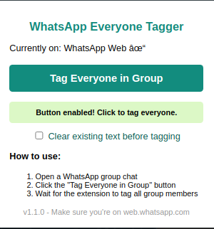

# WhatsApp Everyone Tagger

A Chrome extension that allows you to tag all members in a WhatsApp group chat with a single click.

## Features

- ✅ Tag all members in a WhatsApp group chat with one click
- ✅ Works with the latest version of WhatsApp Web
- ✅ Option to clear existing text or append the tags
- ✅ Simple and intuitive interface
- ✅ Lightweight and fast

## Installation

### From Chrome Web Store (Recommended)

1. Visit [WhatsApp Everyone Tagger on the Chrome Web Store](https://chromewebstore.google.com/detail/afncdbgiiinphhonknflambmlobgpdlo?utm_source=item-share-cb)
2. Click "Add to Chrome"
3. Confirm by clicking "Add extension"

### Manual Installation (Developer Mode)

1. Download or clone this repository to your local machine
2. Open Chrome and navigate to `chrome://extensions/`
3. Enable "Developer mode" by toggling the switch in the top right corner
4. Click "Load unpacked" and select the folder containing the extension files
5. The extension is now installed and ready to use

## How to Use

1. Open [WhatsApp Web](https://web.whatsapp.com/) in your browser
2. Open a group chat where you want to tag everyone
3. Click the WhatsApp Everyone Tagger extension icon in your toolbar
4. Choose whether to clear existing text (checkbox)
5. Click the "Tag Everyone in Group" button
6. All group members will be tagged in the input field
7. Add your message if needed and send!

## Screenshots

## Why This Extension?

WhatsApp doesn't offer a built-in way to tag all members in a group chat at once. This can be time-consuming in large groups when you need everyone's attention. WhatsApp Everyone Tagger solves this problem with a single click!

## Compatibility

- Works with Google Chrome (version 88+)
- Compatible with the latest version of WhatsApp Web
- Does not work with WhatsApp desktop app

## Privacy

This extension:
- Does not collect or store any user data
- Does not send any information to remote servers
- Only interacts with the WhatsApp Web interface
- Requires minimal permissions (only accesses the active WhatsApp Web tab)

## Author

- **[Yassin Slati]** - [yslati](https://github.com/yslati)

## License

This project is completely open source and free to use, modify, and distribute. No copyright restrictions apply.

- You are free to use it for any purpose
- You can modify and adapt it as needed
- You can distribute it to others
- No attribution is required (though always appreciated)

## Support

If you encounter any issues or have suggestions for improvements, please [open an issue](https://github.com/yslati/whatsapp-everyone-tagger/issues) on the GitHub repository.

---

Made with ❤️ for WhatsApp group admins and members